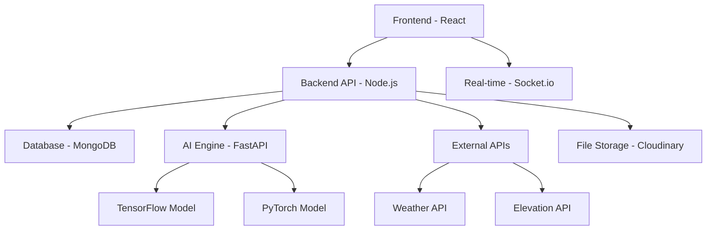

# 🚨 DisasterConnect - AI-Powered Emergency Response System

[](https://opensource.org/licenses/MIT)
[](https://reactjs.org/)
[](https://nodejs.org/)
[](https://mongodb.com/)
[](https://fastapi.tiangolo.com/)

## 📋 Table of Contents
- [Overview](#overview)
- [Features](#features)
- [Architecture](#architecture)
- [Technology Stack](#technology-stack)
- [Getting Started](#getting-started)
- [Project Structure](#project-structure)
- [API Documentation](#api-documentation)
- [AI Models](#ai-models)
- [Screenshots](#screenshots)
- [Contributing](#contributing)
- [License](#license)

## 🌟 Overview

**DisasterConnect** is a comprehensive, AI-powered emergency response and disaster management system designed to revolutionize how communities handle natural disasters and emergencies. The platform combines real-time reporting, intelligent verification, predictive analytics, and coordinated response management into a unified solution.

### 🎯 Mission
To save lives and minimize damage by providing rapid, intelligent, and coordinated emergency response through cutting-edge AI technology and real-time communication systems.

## ✨ Features

### 🤖 AI-Powered Core
- **Smart Image Analysis**: Automated disaster detection from photos using TensorFlow models
- **Damage Assessment**: AI-powered evaluation of infrastructure damage using PyTorch
- **Text Verification**: NLP-based incident report validation and authenticity checking
- **Predictive Analytics**: Risk assessment and early warning systems

### 📱 Public Interface
- **Emergency Reporting**: Intuitive incident reporting with photo/video upload
- **Real-time Map**: Live visualization of incidents, resources, and safe zones
- **Verified Reports**: Public access to confirmed incident history
- **Resource Locator**: Find nearby shelters, medical centers, and relief camps
- **Mobile-First Design**: Responsive interface optimized for emergency situations

### 👨‍💼 Admin Dashboard
- **Command Center**: Comprehensive emergency management interface
- **Resource Management**: CRUD operations for emergency resources
- **Report Verification**: AI-assisted incident validation and prioritization
- **Interactive Operations Map**: Real-time incident tracking and response coordination
- **Predictive Risk Analysis**: Advanced analytics for proactive disaster preparation
- **Real-time Communication**: Socket.io powered live updates

### 🔄 Real-time Systems
- **Live Updates**: WebSocket-based real-time notifications
- **Geographic Alerts**: Location-based emergency notifications
- **Status Tracking**: Real-time incident and resource status updates
- **Multi-user Coordination**: Simultaneous admin collaboration

## 🏗️ Architecture



### System Components

1. **Frontend (React + Vite)**
   - User interfaces for public and admin users
   - Real-time map visualizations using Leaflet
   - Responsive design with Tailwind CSS

2. **Backend API (Node.js + Express)**
   - RESTful API endpoints
   - Authentication and authorization
   - Database operations and business logic
   - Real-time WebSocket communication

3. **AI Engine (FastAPI + Python)**
   - Disaster detection from images
   - Infrastructure damage assessment
   - Text analysis and verification

4. **Database (MongoDB)**
   - Document-based storage for incidents, resources, and users
   - Geospatial indexing for location-based queries
   - Real-time data synchronization

## 🛠️ Technology Stack

### Frontend
- **Framework**: React 19.1.1 with Vite
- **Styling**: Tailwind CSS with custom components
- **Maps**: Leaflet with React-Leaflet
- **Icons**: Lucide React
- **Routing**: React Router DOM
- **HTTP Client**: Axios
- **Real-time**: Socket.io Client

### Backend
- **Runtime**: Node.js with Express.js
- **Database**: MongoDB with Mongoose ODM
- **Authentication**: JWT with bcrypt
- **File Upload**: Multer with Cloudinary integration
- **Real-time**: Socket.io Server
- **Environment**: dotenv for configuration
- **HTTP Client**: Axios for external API calls

### AI Engine
- **Framework**: FastAPI (Python)
- **ML Libraries**: 
  - TensorFlow (Disaster Detection)
  - PyTorch (Damage Assessment)
  - OpenCV (Image Processing)
  - NumPy (Numerical Operations)
- **Image Processing**: PIL, scikit-image

### External Services
- **Weather Data**: OpenWeatherMap API
- **Elevation Data**: Open-Elevation API with backup
- **File Storage**: Cloudinary CDN
- **Maps**: OpenStreetMap tiles

## 🚀 Getting Started

### Prerequisites
- **Node.js** (v16 or higher)
- **Python** (v3.8 or higher)
- **MongoDB** (local or MongoDB Atlas)
- **Git**

### Installation

1. **Clone the Repository**
   ```bash
   git clone https://github.com/ADITYABHAVAR17/DisasterManager.git
   cd DisasterManager
   ```

2. **Setup Backend**
   ```bash
   cd backend
   npm install
   
   # Create .env file
   cp .env.example .env
   # Edit .env with your configuration
   
   # Seed initial data (optional)
   npm run seed:admin
   npm run seed:resources
   
   # Start backend server
   npm start
   # or for development
   npm run dev
   ```

3. **Setup AI Engine**
   ```bash
   cd ../ai
   
   # Create virtual environment (recommended)
   python -m venv venv
   source venv/bin/activate  # On Windows: venv\Scripts\activate
   
   # Install dependencies
   pip install -r requirements.txt
   
   # Start FastAPI server
   python fastapi_backend.py
   ```

4. **Setup Frontend**
   ```bash
   cd ../frontend
   npm install
   
   # Start development server
   npm run dev
   ```

5. **Access the Application**
   - **Frontend**: http://localhost:3000
   - **Backend API**: http://localhost:5000
   - **AI Engine**: http://localhost:8000
   - **API Documentation**: http://localhost:8000/docs

### Environment Variables

#### Backend (.env)
```env
PORT=5000
MONGODB_URI=mongodb://localhost:27017/disaster-manager
JWT_SECRET=your-super-secret-jwt-key
CLOUDINARY_CLOUD_NAME=your-cloudinary-cloud-name
CLOUDINARY_API_KEY=your-cloudinary-api-key
CLOUDINARY_API_SECRET=your-cloudinary-api-secret
WEATHER_API_KEY=your-openweathermap-api-key
```

#### AI Engine
```env
# Model file paths (place model files in /ai directory)
DISASTER_MODEL_PATH=disaster.h5
DAMAGE_MODEL_PATH=best_damage.pth
```

## 📁 Project Structure

```
DisasterManager/
├── 📁 frontend/                 # React frontend application
│   ├── 📁 public/              # Static assets
│   ├── 📁 src/
│   │   ├── 📁 components/       # Reusable React components
│   │   │   ├── ErrorBoundary.jsx
│   │   │   ├── Navigation.jsx
│   │   │   ├── ReportForm.jsx
│   │   │   ├── InteractiveOperationsMap.jsx
│   │   │   └── ...
│   │   ├── 📁 pages/           # Page components
│   │   │   ├── Home.jsx
│   │   │   ├── AdminDashboard.jsx
│   │   │   ├── VerifiedReportsMap.jsx
│   │   │   └── ...
│   │   ├── 📁 contexts/        # React contexts
│   │   ├── 📁 styles/          # CSS files
│   │   └── 📁 api/             # API client functions
│   ├── package.json
│   └── vite.config.js
│
├── 📁 backend/                  # Node.js backend server
│   ├── 📁 config/              # Configuration files
│   │   ├── db.js               # MongoDB connection
│   │   └── cloudinary.js       # Cloudinary setup
│   ├── 📁 models/              # MongoDB schemas
│   │   ├── reportModel.js      # Incident reports
│   │   ├── resourceModel.js    # Emergency resources
│   │   └── adminModel.js       # Admin users
│   ├── 📁 routes/              # API routes
│   │   ├── reportRoutes.js     # Report CRUD operations
│   │   ├── resourceRoutes.js   # Resource management
│   │   ├── authRoutes.js       # Authentication
│   │   └── dashboardRoutes.js  # Dashboard analytics
│   ├── 📁 controllers/         # Business logic
│   ├── 📁 middleware/          # Express middleware
│   ├── 📁 predictive/          # Risk analysis system
│   │   ├── riskCalculator.js   # Risk assessment engine
│   │   └── predictiveController.js
│   ├── server.js               # Main server file
│   └── package.json
│
├── 📁 ai/                      # AI/ML backend (FastAPI)
│   ├── fastapi_backend.py      # Main FastAPI application
│   ├── damage_model.py         # Damage assessment model
│   ├── test_disaster_auto.py   # Model testing scripts
│   ├── disaster.h5             # TensorFlow model (disaster detection)
│   ├── best_damage.pth         # PyTorch model (damage assessment)
│   └── requirements.txt        # Python dependencies
│
├── 📄 README.md                # This file
├── 📄 .gitignore              # Git ignore patterns
└── 📄 LICENSE                 # MIT License
```

## 🔗 API Documentation

### Core Endpoints

#### Reports API
- `GET /api/reports` - Fetch all incident reports
- `POST /api/reports` - Create new incident report
- `PUT /api/reports/:id` - Update incident report
- `DELETE /api/reports/:id` - Delete incident report

#### Resources API
- `GET /api/resources` - Fetch emergency resources
- `POST /api/resources` - Create new resource
- `PUT /api/resources/:id` - Update resource
- `DELETE /api/resources/:id` - Delete resource

#### Authentication API
- `POST /api/auth/login` - Admin login
- `POST /api/auth/logout` - Admin logout
- `GET /api/auth/me` - Get current user info

#### Dashboard API
- `GET /api/dashboard/overview` - Dashboard statistics
- `GET /api/dashboard/analytics` - Advanced analytics

#### Predictive API
- `POST /api/predictive/risk-analysis` - Calculate risk score
- `GET /api/predictive/weather/:lat/:lng` - Weather data
- `GET /api/predictive/terrain/:lat/:lng` - Terrain analysis

### AI Engine Endpoints
- `POST /predict-disaster` - Disaster detection from image
- `POST /predict-damage` - Infrastructure damage assessment
- `POST /predict-both` - Combined analysis
- `GET /health` - Service health check

## 🤖 AI Models

### 1. Disaster Detection Model (TensorFlow)
- **File**: `disaster.h5`
- **Purpose**: Identifies natural disasters from images
- **Supported Types**: Floods, Fires, Landslides, Storms, Earthquakes
- **Input**: RGB images (224x224)
- **Output**: Disaster type with confidence score

### 2. Damage Assessment Model (PyTorch)
- **File**: `best_damage.pth`
- **Purpose**: Evaluates infrastructure damage severity
- **Categories**: No Damage, Minor, Major, Destroyed
- **Input**: RGB images (variable size)
- **Output**: Damage level with confidence score

### Model Usage
```python
# Example API call for disaster detection
curl -X POST "http://localhost:8000/predict-disaster" \
  -F "file=@disaster_image.jpg"

# Response
{
  "disaster_type": "flooding",
  "confidence": 0.89,
  "analysis_time": "2.3s"
}
```

## 📸 Screenshots

### Public Interface
- **Home Page**: Modern landing page with feature highlights
- **Emergency Reporting**: Intuitive incident reporting form
- **Verified Reports Map**: Public map showing confirmed incidents
- **Real-time Resources**: Live map of emergency resources

### Admin Dashboard
- **Overview Dashboard**: Comprehensive statistics and analytics
- **Interactive Operations Map**: Real-time incident management
- **Resource Management**: CRUD interface for emergency resources
- **Predictive Analytics**: Advanced risk assessment tools

## 🔧 Development

### Code Style
- **Frontend**: ESLint with React configuration
- **Backend**: Standard Node.js conventions
- **AI**: PEP 8 Python style guide

### Testing
```bash
# Frontend tests
cd frontend
npm test

# Backend tests
cd backend
npm test

# AI model tests
cd ai
python -m pytest
```

### Building for Production
```bash
# Frontend build
cd frontend
npm run build

# Backend production
cd backend
npm start

# AI engine production
cd ai
uvicorn fastapi_backend:app --host 0.0.0.0 --port 8000
```

## 🌐 Deployment

### Docker Support (Coming Soon)
```dockerfile
# Example Docker setup
FROM node:18-alpine
WORKDIR /app
COPY package*.json ./
RUN npm install
COPY . .
EXPOSE 3000
CMD ["npm", "start"]
```

### Cloud Deployment Options
- **Frontend**: Vercel, Netlify, AWS S3 + CloudFront
- **Backend**: AWS EC2, Heroku, Railway
- **Database**: MongoDB Atlas, AWS DocumentDB
- **AI Engine**: AWS Lambda, Google Cloud Run

## 🤝 Contributing

We welcome contributions! Please see our [Contributing Guidelines](CONTRIBUTING.md) for details.

### Development Workflow
1. Fork the repository
2. Create a feature branch (`git checkout -b feature/amazing-feature`)
3. Commit your changes (`git commit -m 'Add some amazing feature'`)
4. Push to the branch (`git push origin feature/amazing-feature`)
5. Open a Pull Request

### Issue Reporting
Please use the [GitHub Issues](https://github.com/ADITYABHAVAR17/DisasterManager/issues) page to report bugs or request features.

## 📄 License

This project is licensed under the MIT License - see the [LICENSE](LICENSE) file for details.

## 🙏 Acknowledgments

- **OpenStreetMap** for map tiles
- **OpenWeatherMap** for weather data
- **Cloudinary** for image storage
- **TensorFlow** and **PyTorch** communities
- **React** and **Node.js** ecosystems

## 📞 Support

For support, email [adityabhavar17@gmail.com](mailto:adityabhavar17@gmail.com) or create an issue on GitHub.

## 🔮 Roadmap

### Phase 1 (Current)
- ✅ Basic emergency reporting
- ✅ AI-powered verification
- ✅ Real-time map visualization
- ✅ Admin dashboard

### Phase 2 (Upcoming)
- 🔄 Mobile applications (iOS/Android)
- 🔄 Advanced ML models
- 🔄 Multi-language support
- 🔄 Integration with government systems

### Phase 3 (Future)
- 📱 Offline capability
- 🌐 Multi-tenant support
- 📊 Advanced analytics
- 🤖 Chatbot assistance

---

<div align="center">

**Built with ❤️ for saving lives and building resilient communities**

[🌟 Star this repo](https://github.com/ADITYABHAVAR17/DisasterManager) | [🐛 Report Bug](https://github.com/ADITYABHAVAR17/DisasterManager/issues) | [💡 Request Feature](https://github.com/ADITYABHAVAR17/DisasterManager/issues)

</div>